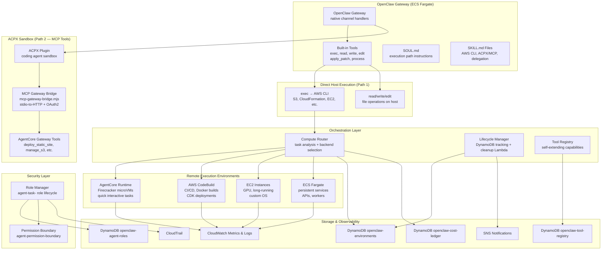
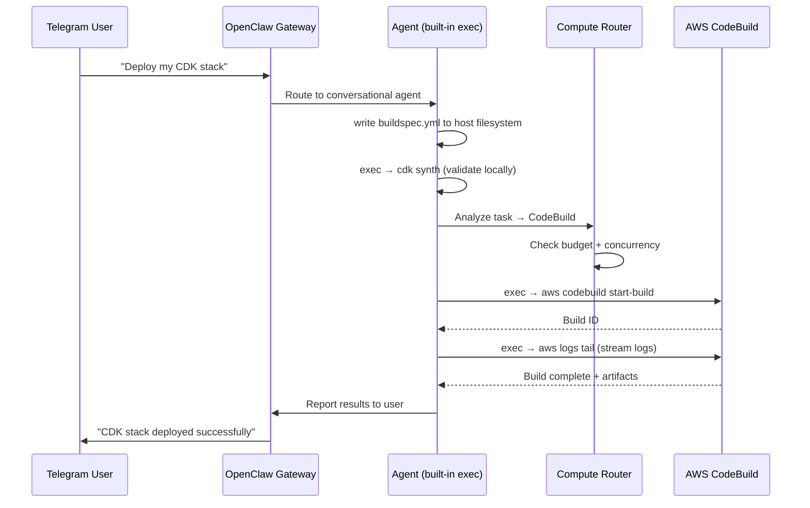
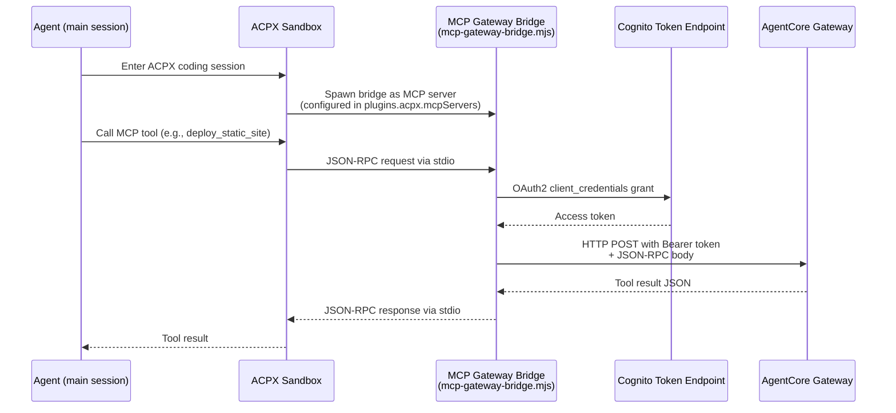
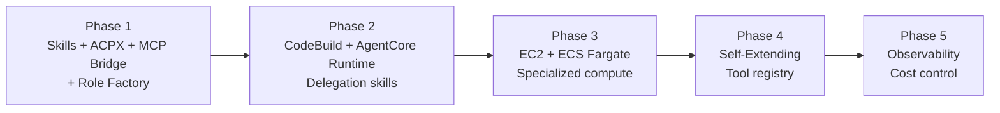

# Design Document: Dynamic Execution Environments

## Overview

This design extends the OpenClaw AWS deployment with a hybrid execution architecture. The OpenClaw Gateway on ECS Fargate remains the agent's brain. Two distinct execution paths provide the agent's hands:

1. **Direct host execution via built-in tools + AWS CLI**: The agent uses its built-in `exec` tool to run AWS CLI commands directly on the Fargate container host for S3 operations, CloudFormation management, EC2 queries, and other direct AWS operations. No sandbox needed.

2. **ACPX sandbox with MCP bridge for Gateway tools**: AgentCore Gateway MCP tools (deploy_static_site, manage_s3, etc.) are only available inside ACPX sessions. The `mcp-gateway-bridge.mjs` (stdio-to-HTTP proxy with OAuth2) is configured under `plugins.acpx.mcpServers` so the agent can call Gateway tools via MCP JSON-RPC protocol from within the ACPX coding sandbox.

SKILL.md files teach the agent when to use each path. Heavy execution — CDK deployments, Docker builds, GPU workloads, persistent services — is delegated to remote AWS compute environments.

The system introduces six key components:

1. **Host Execution + Skills + ACPX** — Agent uses built-in tools (`exec`, `read`, `write`, `edit`) on the Fargate host for AWS CLI operations; ACPX provides MCP Gateway tool access via the bridge; SKILL.md files teach when to use each path
2. **Compute Backends** — AgentCore Runtime (microVMs), CodeBuild (CI/CD), EC2 (specialized), ECS Fargate (services)
3. **Compute Router** — Analyzes task characteristics and selects the optimal backend
4. **Lifecycle Manager** — Tracks active environments, enforces limits, auto-cleans orphans
5. **Self-Extending Registry** — Agent-created tools registered dynamically on AgentCore Gateway
6. **Role Manager** — Task-scoped IAM role lifecycle with permission boundary enforcement

### Key Design Decisions

1. **Two execution paths, not one**: Built-in `exec` + AWS CLI for direct AWS operations (fast, no sandbox overhead). ACPX + MCP bridge for AgentCore Gateway tools (MCP servers only run inside ACPX sessions — this is an OpenClaw architectural constraint, not a choice).
2. **ACPX is required in Phase 1**: Since MCP tools only work inside ACPX sessions, ACPX must be installed and enabled from the start. The Docker image includes the `acpx` binary and the ACPX plugin is enabled in `openclaw.json`.
3. **SKILL.md files teach execution path selection**: Rather than hard-coding delegation logic, SKILL.md files teach the agent when to use `exec` + AWS CLI (direct operations), when to enter ACPX for MCP tools, and when to delegate to remote compute.
4. **`configure-gateway.mjs` writes to `plugins.entries.acpx.config.mcpServers`**: OpenClaw overwrites `openclaw.json` on startup. The script sets `meta.lastTouchedVersion` to prevent overwrite and writes MCP bridge config to `plugins.entries.acpx.config.mcpServers` (not `mcp.servers`, which is CLI-only). Plugin config must use the `plugins.entries.<id>.config` path — OpenClaw's strict config schema rejects unknown top-level keys under `plugins`.
5. **DynamoDB for environment and role tracking**: The `openclaw-environments` table tracks active execution environments. A separate `openclaw-agent-roles` table tracks agent-created IAM roles with creation time, purpose, and expiry.
6. **Task-scoped IAM roles with permission boundary**: The agent's ECS task role has base read-only permissions. For elevated permissions, the agent creates task-scoped IAM roles prefixed with `agent-task-`, each constrained by the `agent-permission-boundary` managed policy. Budget and role count limits are enforced at the router level before provisioning.
7. **Cleanup Lambda on dual schedules**: An EventBridge-triggered Lambda runs every 30 minutes to terminate expired environments, and every 6 hours to delete agent-created IAM roles older than 24 hours.

## Architecture

### System Architecture Diagram



### Delegation Flow (CodeBuild Example)



### MCP Tool Call Flow (via ACPX)



### Implementation Phases




## Components and Interfaces

### 1. Host Execution + Skills + ACPX (SKILL.md files + SOUL.md + ACPX plugin)

The agent has two execution paths, each suited to different operations:

**Path 1 — Direct host execution via built-in tools:**
- `exec` → `aws s3 ls` — list S3 buckets
- `exec` → `aws s3 mb s3://agent-my-site-123` — create bucket
- `exec` → `aws codebuild start-build --project-name agent-deploy ...` — delegate to CodeBuild
- `exec` → `aws cloudformation describe-stacks ...` — query infrastructure
- `read`/`write`/`edit` — file operations directly on the host filesystem

**Path 2 — ACPX sandbox for MCP Gateway tools:**
- Agent enters an ACPX coding session
- ACPX spawns the MCP gateway bridge as a child process (configured in `plugins.acpx.mcpServers`)
- Agent calls MCP tools (deploy_static_site, manage_s3, etc.) via standard MCP protocol
- Bridge handles OAuth2 token exchange with Cognito and proxies JSON-RPC to the Gateway HTTP endpoint

**SOUL.md updates:**
- Instruct the agent to use `exec` + AWS CLI for direct AWS operations (S3, CloudFormation, EC2 queries)
- Instruct the agent to enter ACPX when it needs AgentCore Gateway MCP tools
- Instruct the agent to delegate heavy execution (CDK deployments, Docker builds, long-running tasks) to remote environments
- Reference SKILL.md files for specific patterns

**SKILL.md files** are uploaded to S3 under the agent's workspace prefix (`s3://{bucket}/workspaces/{agent-id}/skills/`) and loaded by the Gateway at startup:

```
skills/
├── aws-infrastructure/SKILL.md       # How to use AWS CLI for infrastructure operations
├── acpx-mcp-tools/SKILL.md           # How to use ACPX for MCP Gateway tool access
├── codebuild-delegation/SKILL.md     # How to delegate to CodeBuild
├── agentcore-runtime/SKILL.md        # How to use AgentCore Runtime
├── ec2-delegation/SKILL.md           # How to provision EC2 instances
├── ecs-fargate-delegation/SKILL.md   # How to deploy Fargate services
├── role-factory/SKILL.md             # How to create and assume task-scoped roles
└── self-extending/SKILL.md           # How to create and register new tools
```

**ACPX enablement (required for Phase 1):**
- The Docker image MUST include the `acpx` binary — MCP tools require ACPX sessions to function
- The `configure-gateway.mjs` script writes MCP bridge config to `plugins.entries.acpx.config.mcpServers`:
  ```json
  {
    "plugins": {
      "entries": {
        "acpx": {
          "config": {
            "mcpServers": {
              "aws-tools": {
                "command": "node",
                "args": ["/app/scripts/mcp-gateway-bridge.mjs"],
                "env": {
                  "GATEWAY_MCP_URL": "...",
                  "GATEWAY_CLIENT_ID": "...",
                  "GATEWAY_CLIENT_SECRET": "...",
                  "GATEWAY_TOKEN_URL": "...",
                  "GATEWAY_SCOPE": "..."
                }
              }
            }
          }
        }
      }
    }
  }
  ```
- The script sets `meta.lastTouchedVersion` to prevent OpenClaw from overwriting the config on startup
- The `mcp.servers` key is NOT used for Gateway tool access (it's CLI-only management)
- Plugin config MUST go through `plugins.entries.<id>.config` — OpenClaw's config schema uses strict validation and rejects unknown top-level keys under `plugins`

**`configure-gateway.mjs` config overwrite handling:**
OpenClaw overwrites `openclaw.json` on startup if it detects the config was not written by a recent version. The script sets `meta.lastTouchedVersion` to the current OpenClaw version string, which signals to OpenClaw that this is an authoritative config and should not be overwritten. This is critical because without it, the `plugins.entries.acpx.config.mcpServers` section gets stripped on restart.

### 2. Compute Router (`adapters/compute-router.ts`)

Analyzes task text and metadata to select the optimal execution environment.

```typescript
interface ComputeRouter {
  /** Analyze task and return recommended backend with cost estimate */
  route(task: TaskAnalysis): Promise<RoutingDecision>;

  /** Check if provisioning is allowed (budget + concurrency) */
  canProvision(): Promise<ProvisionCheck>;
}

interface TaskAnalysis {
  description: string;
  estimatedDuration?: 'short' | 'medium' | 'long';  // <5min, 5min-1hr, >1hr
  requiresGpu?: boolean;
  requiresDocker?: boolean;
  requiresPersistence?: boolean;
  explicitBackend?: BackendType;
}

type BackendType = 'agentcore-runtime' | 'codebuild' | 'ec2' | 'ecs-fargate';

interface RoutingDecision {
  backend: BackendType;
  reasoning: string;
  estimatedCostUsd: number;
  instanceType?: string;  // for EC2
  buildImage?: string;    // for CodeBuild
}

interface ProvisionCheck {
  allowed: boolean;
  activeRoleCount: number;
  maxConcurrentRoles: number;
  monthlySpendUsd: number;
  monthlyBudgetUsd: number;
  reason?: string;  // if not allowed
}
```

**Routing rules (from Requirement 6):**

| Task Pattern | Backend |
|---|---|
| Quick command, interactive, code testing | AgentCore Runtime |
| CDK deploy, CloudFormation, Docker build, CI/CD | CodeBuild |
| GPU workload, long-running (>8hr), custom OS | EC2 |
| Persistent API service, worker process | ECS Fargate |
| Batch data processing | AgentCore Runtime or CodeBuild |

**Cost estimation:**
- AgentCore Runtime: ~$0.001/min (Firecracker microVM)
- CodeBuild: ~$0.005/min (general1.small)
- EC2 c7g.large: ~$0.072/hr
- EC2 GPU (g5.xlarge): ~$1.006/hr
- ECS Fargate (0.5 vCPU): ~$0.025/hr

### 3. AgentCore Runtime Backend (`adapters/agentcore-runtime-backend.ts`)

Delegates quick interactive tasks to AgentCore Runtime Firecracker microVMs.

```typescript
interface AgentCoreRuntimeBackend {
  /** Create a new runtime session */
  createSession(config: RuntimeSessionConfig): Promise<RuntimeSession>;

  /** Execute a command in an existing session */
  executeCommand(sessionId: string, command: string): AsyncIterable<string>;

  /** Stop and clean up a session */
  destroySession(sessionId: string): Promise<void>;
}

interface RuntimeSessionConfig {
  templateId: string;       // pre-configured runtime template
  idleTimeoutMinutes: number;  // default: 15
  environmentId: string;    // tracking ID for lifecycle management
}

interface RuntimeSession {
  sessionId: string;
  environmentId: string;
  status: 'active' | 'idle' | 'terminated';
  createdAt: number;
}
```

**Key behaviors:**
- Uses `InvokeAgentRuntime` for reasoning tasks, `InvokeAgentRuntimeCommand` for deterministic shell commands
- Supports persistent filesystem across session stop/resume
- Pre-configured templates: `infra-tools` (AWS CLI, CDK, Node.js), `data-science` (Python, pandas, numpy), `general` (Git, Node.js, Python)
- Auto-cleanup idle sessions after configurable timeout (default: 15 minutes)
- Streams output back to the agent in real time
- Notifies agent when approaching 8-hour session limit

### 4. CodeBuild Backend (`adapters/codebuild-backend.ts`)

Delegates build and deployment tasks to AWS CodeBuild.

```typescript
interface CodeBuildBackend {
  /** Start a build with agent-generated buildspec */
  startBuild(config: BuildConfig): Promise<BuildHandle>;

  /** Stream build logs in real time */
  streamLogs(buildId: string): AsyncIterable<string>;

  /** Get build result after completion */
  getBuildResult(buildId: string): Promise<BuildResult>;
}

interface BuildConfig {
  projectName: string;        // auto-generated with agent- prefix
  buildspec: string;          // YAML buildspec content
  image: string;              // Docker image for build environment
  computeType: string;        // BUILD_GENERAL1_SMALL, etc.
  environmentVariables?: Record<string, string>;
  secretsFromSecretsManager?: string[];  // secret ARNs to inject
  environmentId: string;      // tracking ID
}

interface BuildResult {
  buildId: string;
  status: 'SUCCEEDED' | 'FAILED' | 'STOPPED';
  artifactsLocation?: string;  // S3 URI
  outputs?: Record<string, string>;
  durationSeconds: number;
}
```

**Key behaviors:**
- Creates on-demand build projects with `agent-` prefix
- Supports custom Docker images (CDK-ready, data science, etc.)
- Streams build logs via CloudWatch Logs
- Stores artifacts in S3 with `agent-` prefix
- Supports builds up to 8 hours
- Injects secrets from Secrets Manager as environment variables
- Returns build status, artifacts location, and outputs on completion

### 5. EC2 Backend (`adapters/ec2-backend.ts`)

Provisions EC2 instances for specialized workloads.

```typescript
interface EC2Backend {
  /** Launch an EC2 instance from a pre-approved AMI */
  launchInstance(config: InstanceConfig): Promise<InstanceHandle>;

  /** Execute a command via SSM Session Manager */
  executeCommand(instanceId: string, command: string): AsyncIterable<string>;

  /** Terminate an instance and clean up */
  terminateInstance(instanceId: string): Promise<void>;
}

interface InstanceConfig {
  amiId: string;              // pre-approved AMI
  instanceType: string;       // e.g., g5.xlarge for GPU
  maxLifetimeHours: number;   // default: 4
  ebsVolumeId?: string;       // reattach persistent volume
  environmentId: string;      // tracking ID
}

interface InstanceHandle {
  instanceId: string;
  environmentId: string;
  publicIp?: string;
  status: 'pending' | 'running' | 'terminated';
}
```

**Key behaviors:**
- Launches from pre-approved AMIs with `agent-` name prefix
- Instance type selection based on task requirements (CPU, memory, GPU)
- Commands executed via SSM Session Manager (no SSH keys)
- Auto-terminates after task completion or max lifetime (default: 4 hours)
- Supports persistent EBS volumes across launches
- Permission boundary denies IAM, Organizations, Billing actions
- Streams command output via SSM

### 6. ECS Fargate Backend (`adapters/ecs-fargate-backend.ts`)

Deploys containerized services on ECS Fargate.

```typescript
interface ECSFargateBackend {
  /** Deploy a new service */
  deployService(config: ServiceConfig): Promise<ServiceHandle>;

  /** Update an existing service */
  updateService(serviceArn: string, updates: ServiceUpdate): Promise<void>;

  /** Tear down a service and clean up */
  destroyService(serviceArn: string): Promise<void>;
}

interface ServiceConfig {
  serviceName: string;        // agent- prefix enforced
  containerImage: string;
  cpu: number;                // 256, 512, 1024, etc.
  memory: number;             // MiB
  environmentVariables?: Record<string, string>;
  healthCheckPath?: string;
  environmentId: string;
}

interface ServiceHandle {
  serviceArn: string;
  environmentId: string;
  endpoint?: string;          // ALB URL or task IP
  status: 'ACTIVE' | 'DRAINING' | 'INACTIVE';
}

interface ServiceUpdate {
  containerImage?: string;
  environmentVariables?: Record<string, string>;
}
```


### 7. Environment Lifecycle Manager (`adapters/lifecycle-manager.ts`)

Tracks all active execution environments and handles cleanup.

```typescript
interface LifecycleManager {
  /** Register a new environment */
  register(env: EnvironmentRecord): Promise<void>;

  /** Update last activity timestamp */
  heartbeat(environmentId: string): Promise<void>;

  /** Mark environment as terminated */
  markTerminated(environmentId: string): Promise<void>;

  /** Get all active environments */
  listActive(): Promise<EnvironmentRecord[]>;

  /** Reconcile state with actual running resources */
  reconcile(): Promise<ReconcileResult>;
}

interface EnvironmentRecord {
  environmentId: string;
  backend: BackendType;
  resourceId: string;         // build ID, instance ID, service ARN, session ID
  createdAt: number;
  lastActivity: number;
  maxLifetimeMinutes: number;
  estimatedCostUsd: number;
  status: 'active' | 'terminated' | 'orphaned';
  operatorUserId: string;     // Telegram user ID
}

interface ReconcileResult {
  orphansFound: number;
  orphansTerminated: number;
  errors: string[];
}
```

### 8. Role Manager (`adapters/role-manager.ts`)

Manages the lifecycle of task-scoped IAM roles created by the agent for elevated permissions.

```typescript
interface RoleManager {
  /** Create a task-scoped IAM role with permission boundary */
  createRole(config: RoleConfig): Promise<RoleHandle>;

  /** Assume a task-scoped role via STS */
  assumeRole(roleArn: string, sessionDurationSeconds?: number): Promise<STSCredentials>;

  /** List active agent-created roles */
  listActiveRoles(): Promise<RoleRecord[]>;

  /** Delete an agent-created role */
  deleteRole(roleName: string): Promise<void>;

  /** Check if a new role can be created (role count limit) */
  canCreateRole(): Promise<RoleProvisionCheck>;
}

interface RoleConfig {
  purpose: string;              // human-readable description of why the role is needed
  policyDocument: string;       // JSON IAM policy for the role
  sessionDurationSeconds?: number;  // default: 3600 (1hr), max: 14400 (4hr)
  environmentId?: string;       // optional link to an execution environment
}

interface RoleHandle {
  roleName: string;             // agent-task-{timestamp}-{random}
  roleArn: string;
  createdAt: number;
  expiresAt: number;            // creation + 24 hours
}

interface RoleRecord {
  roleName: string;
  roleArn: string;
  purpose: string;
  createdAt: number;
  expiresAt: number;
  environmentId?: string;
  status: 'active' | 'expired' | 'deleted';
}

interface RoleProvisionCheck {
  allowed: boolean;
  activeRoleCount: number;
  maxConcurrentRoles: number;   // default: 5
  reason?: string;
}

interface STSCredentials {
  accessKeyId: string;
  secretAccessKey: string;
  sessionToken: string;
  expiration: number;
}
```

**Key behaviors:**
- All created roles are named with `agent-task-` prefix (e.g., `agent-task-1711234567-a3f2`)
- Every role MUST have `agent-permission-boundary` managed policy attached as a permission boundary
- Role creation enforced via IAM condition keys (`iam:PermissionsBoundary`) so the boundary cannot be omitted
- STS AssumeRole sessions default to 1 hour, max 4 hours
- Role records tracked in `openclaw-agent-roles` DynamoDB table with creation time, purpose, and expiry
- Max 5 concurrent active roles enforced before creation
- Agent CANNOT modify the permission boundary, remove it from created roles, or modify its own ECS task role

### 9. Cleanup Lambda (`lambdas/environment_cleanup.py`)

EventBridge-triggered Lambda with two schedules:

```python
def handler(event: dict, context) -> dict:
    """
    Triggered by EventBridge on two schedules:
    
    Every 30 minutes (environment cleanup):
      1. Scan openclaw-environments table for active environments
      2. For each: check if exceeded max lifetime
      3. Terminate expired environments via appropriate backend
      4. Send SNS notification for each auto-termination
      5. Reconcile: check for orphaned resources not in the table

    Every 6 hours (role cleanup):
      1. Scan openclaw-agent-roles table for active roles
      2. For each: check if older than 24 hours
      3. Delete expired IAM roles via IAM API
      4. Update DynamoDB record status to 'deleted'
      5. Log deletions to CloudWatch
    """
```

### 10. Tool Registry (`adapters/tool-registry.ts`)

Manages agent-created tools that extend the Gateway's capabilities.

```typescript
interface ToolRegistry {
  /** Register a new agent-created tool */
  register(tool: ToolRecord): Promise<void>;

  /** List all registered tools */
  list(): Promise<ToolRecord[]>;

  /** Remove a tool */
  remove(toolName: string): Promise<void>;

  /** Update Gateway target configuration */
  syncToGateway(): Promise<void>;
}

interface ToolRecord {
  toolName: string;
  toolType: 'lambda' | 'api';
  description: string;
  resourceArn: string;        // Lambda ARN or API endpoint
  createdAt: number;
  usageCount: number;
}
```

### 11. CDK Infrastructure Extensions (`infra/stacks/`)

New CDK stacks added to the existing infrastructure:

```
infra/stacks/
├── ... (existing stacks)
├── compute_environments_stack.py   # DynamoDB tables + cleanup Lambda + EventBridge rule
└── ... 
```

The `compute_environments_stack.py` creates:
- `openclaw-environments` DynamoDB table
- `openclaw-agent-roles` DynamoDB table (role tracking)
- `openclaw-tool-registry` DynamoDB table
- `openclaw-cost-ledger` DynamoDB table
- Cleanup Lambda + EventBridge 30-minute schedule (environments) + 6-hour schedule (roles)
- `agent-permission-boundary` IAM managed policy
- ECS task role with base read-only permissions + scoped role creation
- IAM roles for each compute backend with permission boundaries
- SNS topic for environment lifecycle notifications

### 12. SKILL.md Files

Skills teach the agent when and how to use each capability via natural language markdown. They are uploaded to S3 and loaded by the Gateway at startup.

```
skills/
├── aws-infrastructure/SKILL.md       # How to use AWS CLI for infrastructure operations
├── acpx-mcp-tools/SKILL.md           # How to use ACPX for MCP Gateway tool access
├── codebuild-delegation/SKILL.md     # How to delegate to CodeBuild
├── agentcore-runtime/SKILL.md        # How to use AgentCore Runtime
├── ec2-delegation/SKILL.md           # How to provision EC2 instances
├── ecs-fargate-delegation/SKILL.md   # How to deploy Fargate services
├── role-factory/SKILL.md             # How to create and assume task-scoped roles
└── self-extending/SKILL.md           # How to create and register new tools
```

**aws-infrastructure/SKILL.md** — Teaches the agent to use `exec` → `aws` CLI for:
- S3 operations (create buckets, upload files, configure static hosting)
- CloudFormation stack management (create, update, describe, delete)
- EC2 instance queries (describe instances, security groups, AMIs)
- General AWS resource discovery and management

**acpx-mcp-tools/SKILL.md** — Teaches the agent to use ACPX for MCP Gateway tools:
- When to enter an ACPX session (structured tool access via AgentCore Gateway)
- Available MCP tools on the Gateway (deploy_static_site, manage_s3, etc.)
- How MCP tool calls work inside ACPX (the bridge handles OAuth2 and JSON-RPC automatically)
- When NOT to use ACPX (simple AWS CLI operations should use `exec` directly)

**codebuild-delegation/SKILL.md** — Teaches the agent to delegate builds:
- When to use CodeBuild (CDK deploys, Docker builds, CI/CD pipelines)
- How to write buildspec.yml files
- How to start builds via `exec` → `aws codebuild start-build`
- How to stream logs via `exec` → `aws logs tail`
- How to retrieve artifacts

**agentcore-runtime/SKILL.md** — Teaches the agent to use AgentCore Runtime:
- When to use Runtime (quick interactive tasks, code testing)
- How to invoke via `exec` → `aws bedrock-agentcore invoke-agent-runtime`
- Session management (create, resume, stop)
- Streaming output handling

**ec2-delegation/SKILL.md** — Teaches the agent to provision EC2:
- When to use EC2 (GPU, long-running, custom OS)
- How to launch instances from pre-approved AMIs
- How to execute commands via SSM Session Manager
- Auto-termination and lifecycle management

**ecs-fargate-delegation/SKILL.md** — Teaches the agent to deploy services:
- When to use Fargate (persistent APIs, workers, scheduled jobs)
- How to create task definitions and services
- Health check configuration
- Service updates and teardown

**role-factory/SKILL.md** — Teaches the agent to create task-scoped roles:
- When elevated permissions are needed
- How to create `agent-task-` prefixed roles with permission boundary
- How to assume roles via STS
- Role lifecycle and cleanup

**self-extending/SKILL.md** — Teaches the agent to create new tools:
- How to create Lambda functions and register them on the Gateway
- How to create APIs and add them as OpenAPI targets
- Tool registry management
