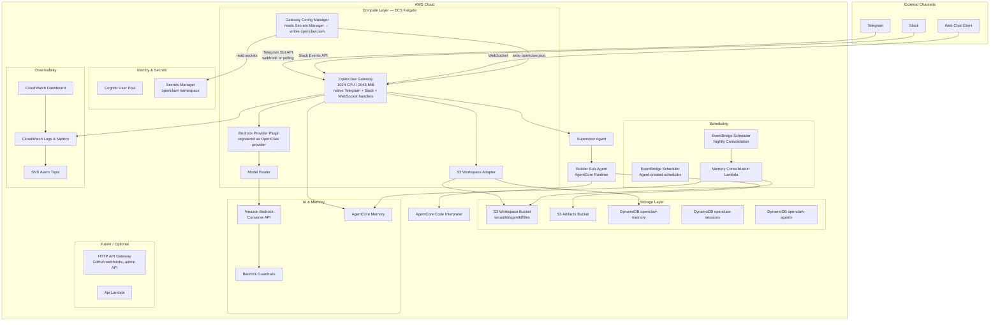
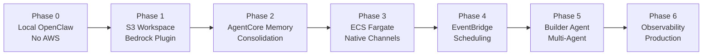
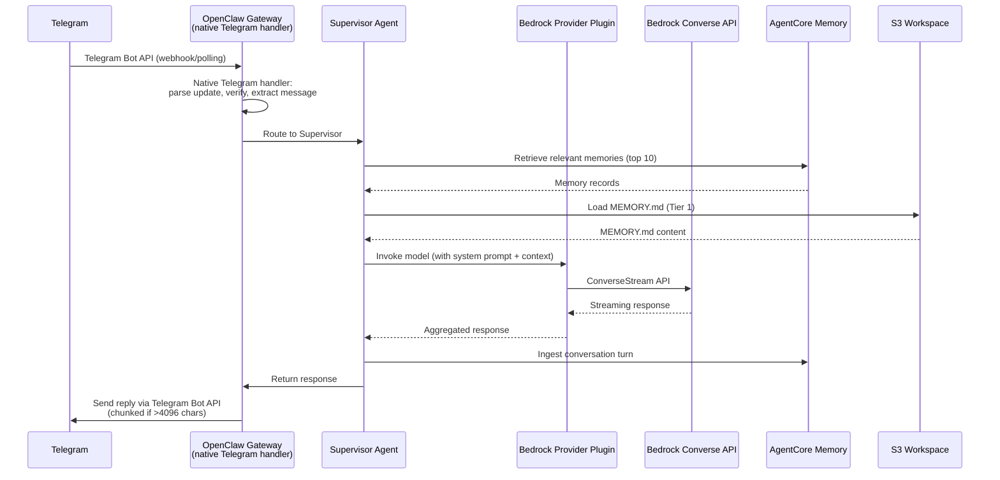

# Design Document: OpenClaw AWS Extension

## Overview

This design extends the OpenClaw AI agent framework to run on AWS using a "fork, don't rewrite" strategy. The core OpenClaw Gateway — including its native Telegram, Slack, WebSocket channel handlers, heartbeat cycle, and cron support — is preserved intact. AWS services are injected at specific adapter seams:

- **S3** replaces the local filesystem for workspace file persistence
- **Bedrock Converse API** replaces the direct Anthropic SDK as an OpenClaw provider plugin
- **AgentCore Memory** replaces local SQLite for semantic/episodic memory
- **ECS Fargate** hosts the Gateway container
- **EventBridge Scheduler** handles Lambda-based scheduled tasks (nightly consolidation, agent-created schedules)
- **Cognito + Secrets Manager** manage identity and credentials
- **CDK Python** defines all infrastructure as code

The OpenClaw Gateway handles all channel integrations natively. No custom webhook Lambda pipeline or SQS queue is needed for messaging. The Api stack (HTTP API Gateway, webhook Lambda) exists for future use (GitHub webhooks, admin API) but is not in the core messaging path.

### Key Design Decisions

1. **Native channel handling**: Telegram, Slack, and WebSocket messages flow directly through the OpenClaw Gateway's built-in handlers. No custom webhook Lambda → SQS pipeline for messaging.
2. **Provider plugin pattern**: The Bedrock adapter registers as an OpenClaw provider plugin, so the Gateway routes model calls through Bedrock natively — not as a standalone adapter layer.
3. **Workspace files are the source of truth**: MEMORY.md, SOUL.md, etc. remain plain UTF-8 markdown in S3. No proprietary formats.
4. **Supervisor-specialist delegation with depth limit of 2**: Prevents runaway delegation chains while enabling specialist sub-agents.
5. **CDK Python stacks per concern**: Separate stacks for Gateway, Storage, Memory, Identity, Scheduler, and Builder — each independently deployable.
6. **Multi-tenant isolation via S3 prefixes + IAM boundaries**: Each tenant gets its own S3 prefix, memory store, and scoped IAM policies.
7. **Gateway Configuration Manager**: Reads secrets from Secrets Manager at startup and writes `openclaw.json` with channel credentials before the Gateway process starts.

## Architecture

### System Architecture Diagram



### Build Phase Progression



### Request Flow (Telegram Message Example)



## Components and Interfaces

### 1. S3 Workspace Adapter (`adapters/s3-workspace.ts`)

A TypeScript module that intercepts OpenClaw's filesystem calls for workspace files and routes them to S3.

```typescript
interface WorkspaceAdapter {
  /** Sync all workspace files from S3 to local filesystem on startup */
  syncFromS3(bucket: string, prefix: string, localPath: string): Promise<void>;

  /** Read a workspace file — returns local copy, falls back to S3 */
  readFile(filename: string): Promise<string>;

  /** Write a mutable workspace file to both local FS and S3 within 5 seconds */
  writeFile(filename: string, content: string): Promise<void>;

  /** List all workspace files under the tenant/agent prefix */
  listFiles(prefix: string): Promise<string[]>;
}
```

**Key behaviors:**

- On startup: `GetObject` for each file in `{tenantId}/{agentId}/` prefix → write to local path
- On write (MEMORY.md, HEARTBEAT.md): write local first, then `PutObject` to S3 (fire-and-forget with error logging)
- Retry: exponential backoff (base 1s, max 3 retries) on S3 errors during startup sync
- Files stored as plain UTF-8 with original filename in S3 key

### 2. Bedrock Provider Plugin (`adapters/bedrock-model.ts`)

A TypeScript module registered as an OpenClaw provider plugin. The Gateway routes all model invocations through this plugin when `provider=bedrock`, using the Bedrock Converse/ConverseStream API.

```typescript
interface ModelAdapter {
  /** Non-streaming invocation via Converse API */
  invoke(params: ConverseInput): Promise<ConverseOutput>;

  /** Streaming invocation via ConverseStream API */
  invokeStream(params: ConverseInput): AsyncIterable<ConverseStreamChunk>;
}

interface ConverseInput {
  modelId: string;
  messages: Message[];
  system?: SystemMessage[];
  inferenceConfig?: InferenceConfig;
  guardrailConfig?: { guardrailIdentifier: string; guardrailVersion: string };
}

interface ConverseOutput {
  content: string;
  usage: { inputTokens: number; outputTokens: number };
  modelId: string;
  stopReason: string;
}
```

**Key behaviors:**

- Registered as an OpenClaw provider plugin so the Gateway natively routes model calls through Bedrock
- Every call includes `guardrailConfig` from environment config
- Cross-region inference: model IDs prefixed with `us.` are passed through as-is
- ThrottlingException: retry with exponential backoff + jitter (base 500ms, max 3 retries)
- Token metrics emitted to CloudWatch after every call: `InputTokens`, `OutputTokens`, `ModelId` dimensions
- When `provider=anthropic` (local mode): plugin is not registered; OpenClaw's native Anthropic SDK path is used

### 3. Model Router (`adapters/model-router.ts`)

Routes model invocations to the most cost-effective Bedrock model based on task complexity.

```typescript
interface ModelRouter {
  /** Select model ID based on task text and metadata */
  selectModel(taskText: string, metadata?: TaskMetadata): string;
}

interface TaskMetadata {
  source: "heartbeat" | "consolidation" | "user" | "builder";
  charCount: number;
}
```

**Routing rules:**
| Condition | Model |
|-----------|-------|
| `source === 'consolidation'` | Claude Haiku |
| Simple patterns (`summarize`, `classify`, `extract`, `translate`, `format`) AND `charCount < 500` | Claude Haiku |
| Complex patterns (`architect`, `design`, `strategy`, `plan infrastructure`, `build`, `deploy`) | Claude Opus |
| Default | Claude Sonnet |

### 4. AgentCore Memory Adapter (`adapters/agentcore_memory.py`)

A Python module that replaces OpenClaw's SQLite semantic index with AgentCore Memory.

```python
class AgentCoreMemoryAdapter:
    def __init__(self, memory_store_id: str, agent_id: str):
        """Initialize with AgentCore Memory store ID."""

    async def ingest(self, user_message: str, agent_response: str, session_id: str) -> None:
        """Ingest a conversation turn as events into AgentCore Memory."""

    async def retrieve(self, query: str, max_results: int = 10) -> list[MemoryRecord]:
        """Semantic search for relevant memories."""

    async def create_store(self, namespace: str) -> str:
        """Create a new memory store with semantic + episodic strategies."""
```

**Key behaviors:**

- Ingest: after each conversation turn, store user message + agent response as conversation events
- Retrieve: semantic search using current user message, return up to 10 records
- MEMORY.md remains Tier 1: loaded in full at every session start (from S3, not from AgentCore)
- When running locally (Phase 0): adapter is inactive, SQLite memory works unchanged

### 5. Memory Consolidation Lambda (`lambdas/memory_consolidation.py`)

A Python Lambda function triggered nightly by EventBridge.

```python
def handler(event: dict, context: LambdaContext) -> dict:
    """
    1. Retrieve all memories from past 24 hours via AgentCore Memory
    2. Read current MEMORY.md from S3
    3. Invoke Claude Haiku to produce updated MEMORY.md (≤100 lines)
    4. Write updated MEMORY.md to S3 and DynamoDB hot cache
    5. Archive raw session logs to S3: memory-archive/{agentId}/{date}/memories.json
    """
```

**Failure mode:** On any error, log to CloudWatch, send SNS alert, leave existing MEMORY.md untouched.

### 6. Gateway Configuration Manager (`docker-entrypoint.sh` + `adapters/gateway-config.ts`)

Responsible for reading secrets from Secrets Manager at container startup and writing `openclaw.json` with channel credentials before the Gateway process starts.

```typescript
interface GatewayConfigManager {
  /** Read channel secrets from Secrets Manager and write openclaw.json */
  configureChannels(): Promise<void>;
}

interface ChannelConfig {
  telegram?: { botToken: string };
  slack?: { botToken: string; appToken: string; signingSecret: string };
  websocket?: { enabled: boolean; port: number };
}
```

**Key behaviors:**

- Runs as part of `docker-entrypoint.sh` before the Gateway process starts
- Reads secrets from Secrets Manager under `openclaw/{tenantId}/` namespace:
  - `openclaw/{tenantId}/telegram-bot-token`
  - `openclaw/{tenantId}/slack-bot-token`
  - `openclaw/{tenantId}/slack-signing-secret`
- Writes `~/.openclaw/openclaw.json` with the channel configuration block
- If a secret is not found, that channel is omitted from the config (Gateway starts without it)
- Channel changes require a container restart (update secret → restart ECS task), not a CDK redeploy

### 7. Supervisor Agent (`agents/supervisor.ts`)

The primary orchestrator that receives all incoming messages from the Gateway's native channel handlers.

```typescript
interface SupervisorAgent {
  /** Process an incoming message, optionally delegating to specialists */
  process(message: IncomingMessage, session: Session): Promise<AgentResponse>;
}

interface IncomingMessage {
  text: string;
  channel: "telegram" | "slack" | "web" | "heartbeat";
  userId: string;
  sessionId: string;
}
```

**Delegation logic:**

- Delegation depth capped at 2 (supervisor → specialist, no further)
- Session ID format for sub-agents: `{rootSessionId}-{agentType}-{step}`
- On specialist failure after 2 retries: supervisor handles task directly
- Specialist types: `infrastructure`, `code`, `communications`, `research`

### 8. Builder Sub-Agent (`agents/builder.py`)

A Strands SDK agent running on AgentCore Runtime for infrastructure provisioning and code deployment.

```python
class BuilderAgent:
    def generate_cdk(self, instruction: str) -> CDKOutput:
        """Generate CDK Python code from natural language instruction."""

    def test_and_deploy(self, cdk_code: str) -> DeployResult:
        """Test via Code Interpreter, run cdk synth, then cdk deploy."""

    def deploy_lambda(self, code: str, function_name: str) -> LambdaDeployResult:
        """Package, store artifact in S3, create/update Lambda, wait for Active state."""
```

**Constraints:**

- All agent-deployed resources prefixed with `agent-`
- Permission boundary denies: `iam:*`, `organizations:*`, `account:*`, `billing:*`
- Bedrock Guardrails applied to every model call that could trigger infrastructure changes
- On CDK deployment failure: report CloudFormation failure events to Supervisor, notify operator

### 9. CDK Infrastructure (`infra/`)

CDK Python application with separate stacks per concern.

```
infra/
├── app.py                    # CDK app entry point
├── stacks/
│   ├── gateway_stack.py      # ECS Fargate + task role + Secrets Manager access
│   ├── api_stack.py          # HTTP API GW + Lambda (GitHub webhooks, admin API — not messaging)
│   ├── storage_stack.py      # S3 buckets + DynamoDB tables
│   ├── memory_stack.py       # AgentCore Memory + consolidation Lambda
│   ├── identity_stack.py     # Cognito + Secrets Manager
│   ├── scheduler_stack.py    # EventBridge rules
│   └── builder_stack.py      # Builder agent role + permission boundary
├── constructs/
│   ├── openclaw_agent.py     # Reusable construct: ECS task + workspace prefix + memory store
│   └── tenant_isolation.py   # Per-tenant IAM boundaries + S3 prefix scoping
└── requirements.txt          # aws-cdk-lib only
```

**Note:** The Api stack is deployed but not in the core messaging path. It can be repurposed for GitHub webhook ingestion or an admin API. All Telegram/Slack/WebSocket messaging flows through the Gateway's native handlers.

**Deployment:** `cd infra && cdk deploy --all`

**CDK version:** Python 3.12+, `aws-cdk-lib` as sole CDK dependency.

## Data Models

### Workspace File S3 Key Structure

```
{tenantId}/{agentId}/SOUL.md
{tenantId}/{agentId}/MEMORY.md
{tenantId}/{agentId}/HEARTBEAT.md
{tenantId}/{agentId}/AGENTS.md
{tenantId}/{agentId}/TOOLS.md
{tenantId}/{agentId}/USER.md
{tenantId}/{agentId}/IDENTITY.md
{tenantId}/{agentId}/memory/YYYY-MM-DD.md        # daily logs
{tenantId}/{agentId}/skills/{skillName}/SKILL.md  # skill files
```

### DynamoDB Table Schemas

#### `openclaw-memory` (Hot-tier MEMORY.md cache)

| Attribute    | Type              | Key           |
| ------------ | ----------------- | ------------- |
| `agent_id`   | String            | Partition Key |
| `file_key`   | String            | Sort Key      |
| `content`    | String            | —             |
| `updated_at` | Number (epoch ms) | —             |
| `version`    | Number            | —             |

#### `openclaw-sessions`

| Attribute     | Type                   | Key                    |
| ------------- | ---------------------- | ---------------------- |
| `agent_id`    | String                 | Partition Key          |
| `session_id`  | String                 | Sort Key               |
| `channel`     | String                 | —                      |
| `user_id`     | String                 | —                      |
| `created_at`  | Number (epoch ms)      | —                      |
| `last_active` | Number (epoch ms)      | —                      |
| `ttl`         | Number (epoch seconds) | TTL attribute (1 hour) |

#### `openclaw-agents`

| Attribute    | Type              | Key           |
| ------------ | ----------------- | ------------- |
| `agent_id`   | String            | Partition Key |
| `tenant_id`  | String            | —             |
| `config`     | Map               | —             |
| `status`     | String            | —             |
| `created_at` | Number (epoch ms) | —             |

### Bedrock Converse API Message Format

```json
{
  "modelId": "us.anthropic.claude-sonnet-4-20250514-v1:0",
  "messages": [
    {
      "role": "user",
      "content": [{ "text": "..." }]
    }
  ],
  "system": [{ "text": "IDENTITY.md + SOUL.md + AGENTS.md + USER.md + MEMORY.md + TOOLS.md" }],
  "inferenceConfig": {
    "maxTokens": 8192,
    "temperature": 0.7
  },
  "guardrailConfig": {
    "guardrailIdentifier": "abc123",
    "guardrailVersion": "1"
  }
}
```

### openclaw.json Channel Configuration

Generated by the Gateway Configuration Manager at container startup:

```json
{
  "gateway": {
    "controlUi": {
      "dangerouslyAllowHostHeaderOriginFallback": true
    }
  },
  "telegram": {
    "botToken": "<from Secrets Manager>"
  },
  "slack": {
    "botToken": "<from Secrets Manager>",
    "appToken": "<from Secrets Manager>",
    "signingSecret": "<from Secrets Manager>"
  }
}
```

### Session ID Format

```
{rootSessionId}-{agentType}-{step}

Examples:
  sess_abc123                          # root session
  sess_abc123-infrastructure-1         # builder sub-agent, step 1
  sess_abc123-code-1                   # code sub-agent, step 1
```

### Memory Consolidation Prompt Template

```
You are a memory curator for an AI agent. Given:
1. The current MEMORY.md content
2. New memories from the past 24 hours

Produce an updated MEMORY.md that:
- Retains relevant, still-accurate facts
- Adds important new facts from today's memories
- Removes outdated or contradicted entries
- Stays under 100 lines
- Preserves markdown formatting

Current MEMORY.md:
{current_memory}

New memories (last 24 hours):
{new_memories}

Output only the updated MEMORY.md content, nothing else.
```

### Model Router Configuration

```typescript
const SIMPLE_PATTERNS = /\b(summarize|classify|extract|translate|format)\b/i;
const COMPLEX_PATTERNS = /\b(architect|design|strategy|plan.?infrastructure|build|deploy)\b/i;
const CHAR_THRESHOLD = 500;

const MODEL_MAP = {
  simple: "us.anthropic.claude-haiku-4-5-20251001-v1:0",
  complex: "us.anthropic.claude-opus-4-5-20251101-v1:0",
  default: "us.anthropic.claude-sonnet-4-20250514-v1:0",
};
```

### Tenant Isolation IAM Policy Template

```json
{
  "Version": "2012-10-17",
  "Statement": [
    {
      "Effect": "Allow",
      "Action": ["s3:GetObject", "s3:PutObject", "s3:ListBucket"],
      "Resource": ["arn:aws:s3:::openclaw-workspace/{tenantId}/*"],
      "Condition": {
        "StringLike": {
          "s3:prefix": ["{tenantId}/*"]
        }
      }
    },
    {
      "Effect": "Allow",
      "Action": ["secretsmanager:GetSecretValue"],
      "Resource": "arn:aws:secretsmanager:*:*:secret:openclaw/{tenantId}/*"
    }
  ]
}
```

### Builder Permission Boundary

```json
{
  "Version": "2012-10-17",
  "Statement": [
    {
      "Effect": "Allow",
      "Action": "*",
      "Resource": "*"
    },
    {
      "Effect": "Deny",
      "Action": [
        "iam:*",
        "organizations:*",
        "account:*",
        "aws-portal:*",
        "budgets:*",
        "ce:*",
        "cur:*"
      ],
      "Resource": "*"
    }
  ]
}
```

## Correctness Properties

_A property is a characteristic or behavior that should hold true across all valid executions of a system — essentially, a formal statement about what the system should do. Properties serve as the bridge between human-readable specifications and machine-verifiable correctness guarantees._

### Property 1: S3 Workspace File Round-Trip

_For any_ set of workspace files with arbitrary UTF-8 markdown content (including SKILL.md files), writing them to S3 via the S3_Workspace_Adapter and then reading them back (either via sync or direct read) should produce byte-identical content for every file.

**Validates: Requirements 1.1, 1.3, 16.2, 16.3**

### Property 2: Dual-Write Consistency

_For any_ mutable workspace file update (MEMORY.md or HEARTBEAT.md), after the write completes, the content in the local filesystem, the content in S3, and (for MEMORY.md) the content in the DynamoDB hot cache should all be identical.

**Validates: Requirements 1.2, 4.3**

### Property 3: S3 Workspace Key Structure

_For any_ tenant ID, agent ID, and filename, the S3 key produced by the S3_Workspace_Adapter should equal `{tenantId}/{agentId}/{filename}`. For daily logs, the key should match `{tenantId}/{agentId}/memory/YYYY-MM-DD.md`.

**Validates: Requirements 1.5, 16.3, 16.4**

### Property 4: Converse API Request Formation

_For any_ model invocation when the provider is configured as `bedrock`, the Bedrock_Provider_Plugin should produce a valid Converse API request containing: the configured model ID (including cross-region `us.` prefixed IDs passed through unchanged), the configured guardrail identifier and version in the `guardrailConfig` field, and the system prompt assembled from workspace files.

**Validates: Requirements 2.1, 2.3, 2.5, 10.3**

### Property 5: Token Metrics Emission

_For any_ Bedrock model invocation that returns a response, the plugin should emit a metrics record containing `inputTokens` (non-negative integer), `outputTokens` (non-negative integer), and `modelId` (non-empty string).

**Validates: Requirements 2.6**

### Property 6: Channel Configuration Generation

_For any_ set of channel secrets stored in Secrets Manager under the `openclaw/{tenantId}/` namespace, the Gateway Configuration Manager should produce an `openclaw.json` file where each configured channel (Telegram, Slack) contains the corresponding secret values, and channels whose secrets are absent are omitted from the configuration.

**Validates: Requirements 6.1, 6.3, 8.2, 8.3**

### Property 7: Memory Ingest Completeness

_For any_ completed conversation turn consisting of a user message and agent response, the AgentCore Memory Adapter should ingest both the user message and the agent response as events into the memory store.

**Validates: Requirements 3.1**

### Property 8: Memory Retrieval Bound

_For any_ semantic search query against AgentCore Memory, the number of returned memory records should be at most 10.

**Validates: Requirements 3.2**

### Property 9: Memory Consolidation Line Limit

_For any_ output produced by the Memory Consolidation Lambda, the resulting MEMORY.md content should contain at most 100 lines.

**Validates: Requirements 4.2**

### Property 10: Memory Archive Key Format

_For any_ agent ID and date, the archive key produced by the Memory Consolidation Lambda should match the pattern `memory-archive/{agentId}/{YYYY-MM-DD}/memories.json`.

**Validates: Requirements 4.4**

### Property 11: Model Router Selection

_For any_ task text and metadata, the model router should select: Claude Haiku when the source is `consolidation` or when the task matches simple patterns (`summarize`, `classify`, `extract`, `translate`, `format`) and is under 500 characters; Claude Opus when the task matches complex patterns (`architect`, `design`, `strategy`, `plan infrastructure`, `build`, `deploy`); and Claude Sonnet for all other cases. The selection should be deterministic for the same input.

**Validates: Requirements 13.1, 13.2, 13.3, 13.4**

### Property 12: Delegation Depth Limit

_For any_ chain of agent delegations starting from the Supervisor Agent, the delegation depth should never exceed 2 (supervisor → specialist, no further nesting).

**Validates: Requirements 9.4**

### Property 13: Sub-Agent Session ID Format

_For any_ root session ID, agent type, and step number, the generated sub-agent session ID should match the format `{rootSessionId}-{agentType}-{step}`.

**Validates: Requirements 9.6**

### Property 14: Builder Resource Prefix

_For any_ AWS resource name generated by the Builder Sub-Agent, the resource name should start with the prefix `agent-`.

**Validates: Requirements 10.5**

### Property 15: Code Deployment Gate

_For any_ code deployment request, the deployment should only proceed if the associated unit tests pass in the Code Interpreter. If tests fail, deployment should not occur.

**Validates: Requirements 11.1**

### Property 16: Lambda Version Tracking

_For any_ Lambda deployment, the deployment tool should record the previous function version before deploying the new version, enabling rollback.

**Validates: Requirements 11.6**

### Property 17: One-Time Schedule Auto-Deletion

_For any_ schedule created by the agent marked as one-time, the resulting EventBridge Scheduler rule should have `ActionAfterCompletion` set to `DELETE`.

**Validates: Requirements 7.3**

### Property 18: Workspace Assembly Order

_For any_ set of workspace files, the system prompt assembly should concatenate them in the order: IDENTITY → SOUL → AGENTS → USER → MEMORY → TOOLS, matching OpenClaw core's ordering.

**Validates: Requirements 16.1**

### Property 19: Tenant Isolation

_For any_ two distinct tenant IDs, the generated IAM policies should ensure: (a) S3 key prefixes are disjoint, (b) AgentCore Memory store IDs are different, and (c) Secrets Manager resource ARNs are scoped to non-overlapping `openclaw/{tenantId}/` namespaces.

**Validates: Requirements 17.1, 17.2, 17.3**

### Property 20: Structured Log Format

_For any_ log entry emitted by the Gateway container, the JSON output should contain the fields `sessionId`, `agentId`, `channel`, and `responseLatency`.

**Validates: Requirements 14.5**

## Error Handling

### Adapter-Level Errors

| Component                | Error Condition                     | Handling Strategy                                                                                    |
| ------------------------ | ----------------------------------- | ---------------------------------------------------------------------------------------------------- |
| S3 Workspace Adapter     | S3 unreachable on startup           | Exponential backoff (base 1s), 3 retries, then fail with descriptive error log                       |
| S3 Workspace Adapter     | S3 write failure on file update     | Log error to CloudWatch, retry once, do not block the Gateway process                                |
| Bedrock Provider Plugin  | `ThrottlingException`               | Exponential backoff with jitter (base 500ms), 3 retries                                              |
| Bedrock Provider Plugin  | `ModelNotReadyException`            | Retry once after 2s, then fail with user-facing error                                                |
| Bedrock Provider Plugin  | `ValidationException`               | Fail immediately, log the invalid request payload for debugging                                      |
| AgentCore Memory Adapter | Memory store unreachable            | Log warning, continue without memory retrieval (graceful degradation)                                |
| AgentCore Memory Adapter | Ingest failure                      | Log error, do not block the response to the user                                                     |
| Gateway Config Manager   | Secret not found in Secrets Manager | Omit that channel from openclaw.json, log warning, Gateway starts without it                         |
| Gateway Config Manager   | Secrets Manager unreachable         | Log error, write minimal openclaw.json without channel config, Gateway starts in WebSocket-only mode |

### Lambda-Level Errors

| Lambda               | Error Condition                 | Handling Strategy                                             |
| -------------------- | ------------------------------- | ------------------------------------------------------------- |
| Memory Consolidation | Claude Haiku invocation failure | Log error, send SNS alert, leave MEMORY.md unchanged          |
| Memory Consolidation | Output exceeds 100 lines        | Truncate to 100 lines, log warning                            |
| Memory Consolidation | S3 write failure                | Log error, send SNS alert, leave existing MEMORY.md unchanged |

### Agent-Level Errors

| Component         | Error Condition                             | Handling Strategy                                                                    |
| ----------------- | ------------------------------------------- | ------------------------------------------------------------------------------------ |
| Supervisor Agent  | Specialist sub-agent failure                | Retry specialist up to 2 times, then handle task directly                            |
| Supervisor Agent  | Delegation depth exceeded                   | Reject delegation, handle task at current level                                      |
| Builder Sub-Agent | CDK synth failure                           | Report error to Supervisor, include synth error output                               |
| Builder Sub-Agent | CDK deploy failure                          | Extract CloudFormation failure events, report to Supervisor, notify operator via SNS |
| Builder Sub-Agent | Code Interpreter test failure               | Revise code using error output, re-test up to 3 iterations, then report failure      |
| Code Deployment   | Lambda not reaching Active state within 60s | Timeout, report failure, do not mark deployment as successful                        |

### Circuit Breaker Pattern

For Bedrock API calls, implement a simple circuit breaker:

- **Closed** (normal): All calls go through
- **Open** (after 5 consecutive failures in 1 minute): Reject calls immediately for 30 seconds, return cached response or error
- **Half-open** (after cooldown): Allow one test call; if it succeeds, close the circuit

This prevents cascading failures when Bedrock is experiencing an outage.

## Testing Strategy

### Dual Testing Approach

This project uses both unit tests and property-based tests for comprehensive coverage:

- **Unit tests**: Verify specific examples, edge cases, error conditions, and integration points
- **Property-based tests**: Verify universal properties across randomly generated inputs (minimum 100 iterations per property)

Both are complementary and necessary. Unit tests catch concrete bugs at specific boundaries. Property tests verify general correctness across the entire input space.

### Property-Based Testing Libraries

| Language   | Library      | Configuration                                                               |
| ---------- | ------------ | --------------------------------------------------------------------------- |
| TypeScript | `fast-check` | Minimum 100 iterations per property, `fc.configureGlobal({ numRuns: 100 })` |
| Python     | `hypothesis` | Minimum 100 examples per property, `@settings(max_examples=100)`            |

The project MUST NOT implement property-based testing from scratch. Use the libraries above.

### Property Test Tagging

Each property-based test must include a comment referencing the design document property:

```typescript
// Feature: openclaw-aws-extension, Property 1: S3 Workspace File Round-Trip
test.prop("workspace files survive S3 round-trip", [fc.string()], (content) => {
  // ...
});
```

```python
# Feature: openclaw-aws-extension, Property 9: Memory Consolidation Line Limit
@given(st.text())
def test_consolidation_output_under_100_lines(memory_content):
    # ...
```

Each correctness property MUST be implemented by a SINGLE property-based test.

### Test Organization

```
tests/
├── unit/
│   ├── adapters/
│   │   ├── s3-workspace.test.ts        # Unit tests for S3 adapter
│   │   ├── bedrock-model.test.ts       # Unit tests for Bedrock provider plugin
│   │   ├── model-router.test.ts        # Unit tests for model router
│   │   ├── gateway-config.test.ts      # Unit tests for Gateway Config Manager
│   │   └── agentcore_memory_test.py    # Unit tests for memory adapter
│   ├── lambdas/
│   │   └── consolidation_test.py       # Unit tests for memory consolidation
│   ├── agents/
│   │   ├── supervisor.test.ts          # Unit tests for supervisor routing
│   │   └── builder_test.py             # Unit tests for builder agent
│   └── infra/
│       └── cdk_stacks_test.py          # CDK template assertions for all stacks
├── property/
│   ├── s3-workspace.prop.ts            # Properties 1, 2, 3
│   ├── bedrock-model.prop.ts           # Properties 4, 5
│   ├── gateway-config.prop.ts          # Property 6
│   ├── model-router.prop.ts            # Property 11
│   ├── memory.prop.py                  # Properties 7, 8, 9, 10
│   ├── orchestration.prop.ts           # Properties 12, 13
│   ├── builder.prop.py                 # Properties 14, 15, 16
│   ├── scheduling.prop.ts              # Property 17
│   ├── workspace-assembly.prop.ts      # Property 18
│   ├── tenant-isolation.prop.py        # Property 19
│   └── logging.prop.ts                 # Property 20
└── integration/
    ├── cdk-synth.test.py               # Verify CDK synthesizes valid templates
    ├── local-mode.test.sh              # Verify Phase 0 local mode works
    └── e2e-channel.test.ts             # End-to-end native channel flow
```

### Unit Test Coverage Focus

Unit tests should focus on:

- **Specific examples**: Known good/bad inputs for each adapter
- **Edge cases**: Empty files, maximum-length messages, Unicode content, missing configuration, missing secrets
- **Error conditions**: S3 unreachable, Bedrock throttling, Secrets Manager failures, DynamoDB failures
- **Integration points**: CDK stack synthesis validation, Lambda handler event parsing, Gateway config generation
- **CDK template assertions**: Verify synthesized CloudFormation templates contain expected resources, properties, and configurations (Requirements 5.1–5.6, 7.1, 7.4, 8.1, 8.5, 12.1–12.5, 14.1–14.4, 15.1–15.5)

Avoid writing excessive unit tests for behaviors already covered by property tests. Property tests handle comprehensive input coverage.

### CDK Snapshot and Assertion Tests

CDK stacks should be tested using `aws_cdk.assertions`:

```python
from aws_cdk import assertions

def test_gateway_stack_fargate_config():
    """Verify Fargate task has 1024 CPU and 2048 MiB memory."""
    template = assertions.Template.from_stack(gateway_stack)
    template.has_resource_properties("AWS::ECS::TaskDefinition", {
        "Cpu": "1024",
        "Memory": "2048"
    })
```

This covers Requirements 5.1–5.6, 7.1, 7.4, 8.1, 8.5, 12.1–12.5, 14.1–14.4, and 15.1–15.5 (CDK stacks and infrastructure configuration).
