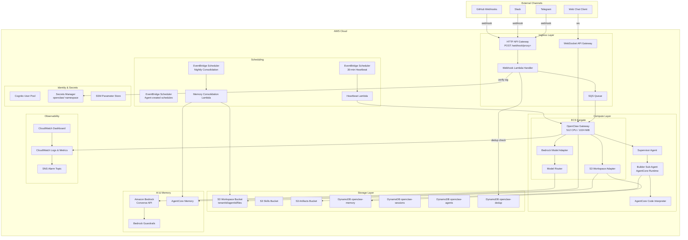
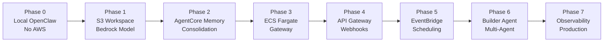
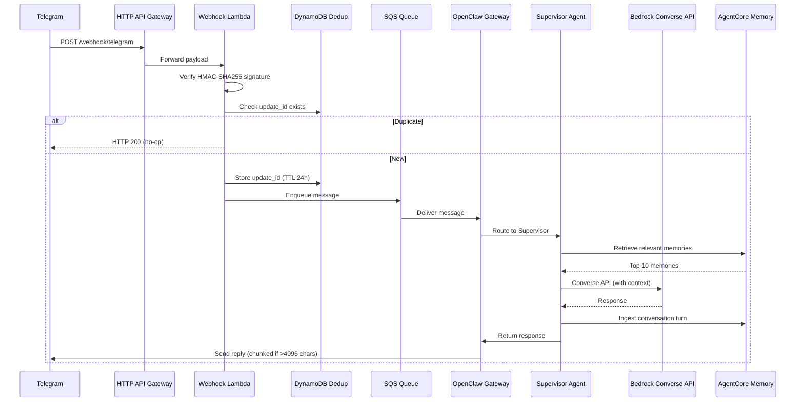

# Design Document: OpenClaw AWS Extension

## Overview

This design extends the OpenClaw AI agent framework to run on AWS using a "fork, don't rewrite" strategy. The core OpenClaw Gateway, workspace file format (SOUL.md, MEMORY.md, etc.), skill format, and multi-agent patterns are preserved. AWS services are injected at specific seams via adapter interfaces:

- **S3** replaces the local filesystem for workspace file persistence
- **Bedrock Converse API** replaces the direct Anthropic SDK for model invocations
- **AgentCore Memory** replaces local SQLite for semantic/episodic memory
- **ECS Fargate** replaces a local machine for running the Gateway
- **EventBridge Scheduler** replaces Node-internal cron for heartbeat and scheduled tasks
- **Cognito + Secrets Manager** replace hardcoded credentials for identity and secrets
- **CDK Python** defines all infrastructure as code

The system progresses through 8 build phases (Phase 0–7). Phase 0 runs locally with zero AWS dependencies. Phases 1–7 incrementally swap in AWS services. The design ensures that at every phase boundary, the agent is functional — either fully local or fully cloud-hosted.

### Key Design Decisions

1. **Adapter pattern over abstraction layers**: Each AWS integration is a concrete adapter implementing the same interface OpenClaw already expects. No new abstraction layers are introduced.
2. **Workspace files are the source of truth**: MEMORY.md, SOUL.md, etc. remain plain UTF-8 markdown in S3. No proprietary formats.
3. **Supervisor-specialist delegation with depth limit of 2**: Prevents runaway delegation chains while enabling specialist sub-agents for infrastructure, code, communications, and research.
4. **CDK Python stacks per concern**: Separate stacks for Gateway, API, Storage, Memory, Identity, Scheduler, and Builder — each independently deployable.
5. **Multi-tenant isolation via S3 prefixes + IAM boundaries**: No shared-database multi-tenancy. Each tenant gets its own S3 prefix, memory store, and scoped IAM policies.

## Architecture

### System Architecture Diagram



### Build Phase Progression



### Request Flow (Telegram Message Example)




## Components and Interfaces

### 1. S3 Workspace Adapter (`adapters/s3-workspace.ts`)

A TypeScript module that intercepts OpenClaw's filesystem calls for workspace files and routes them to S3.

```typescript
interface WorkspaceAdapter {
  /** Sync all workspace files from S3 to local filesystem on startup */
  syncFromS3(bucket: string, prefix: string, localPath: string): Promise<void>;

  /** Read a workspace file — returns local copy, falls back to S3 */
  readFile(filename: string): Promise<string>;

  /** Write a mutable workspace file to both local FS and S3 within 5 seconds */
  writeFile(filename: string, content: string): Promise<void>;

  /** List all workspace files under the tenant/agent prefix */
  listFiles(prefix: string): Promise<string[]>;
}
```

**Key behaviors:**
- On startup: `GetObject` for each file in `{tenantId}/{agentId}/` prefix → write to local path
- On write (MEMORY.md, HEARTBEAT.md): write local first, then `PutObject` to S3 (fire-and-forget with error logging)
- Retry: exponential backoff (base 1s, max 3 retries) on S3 errors during startup sync
- Files stored as plain UTF-8 with original filename in S3 key

### 2. Bedrock Model Adapter (`adapters/bedrock-model.ts`)

A TypeScript module that replaces the Anthropic SDK call path with Bedrock Converse/ConverseStream API.

```typescript
interface ModelAdapter {
  /** Non-streaming invocation via Converse API */
  invoke(params: ConverseInput): Promise<ConverseOutput>;

  /** Streaming invocation via ConverseStream API */
  invokeStream(params: ConverseInput): AsyncIterable<ConverseStreamChunk>;
}

interface ConverseInput {
  modelId: string;
  messages: Message[];
  system?: SystemMessage[];
  inferenceConfig?: InferenceConfig;
  guardrailConfig?: { guardrailIdentifier: string; guardrailVersion: string };
}

interface ConverseOutput {
  content: string;
  usage: { inputTokens: number; outputTokens: number };
  modelId: string;
  stopReason: string;
}
```

**Key behaviors:**
- Every call includes `guardrailConfig` from environment config
- Cross-region inference: model IDs prefixed with `us.` are passed through as-is
- ThrottlingException: retry with exponential backoff + jitter (base 500ms, max 3 retries)
- Token metrics emitted to CloudWatch after every call: `InputTokens`, `OutputTokens`, `ModelId` dimensions
- When `provider=anthropic` (local mode): adapter is not instantiated; OpenClaw's native SDK path is used

### 3. Model Router (`adapters/model-router.ts`)

Routes model invocations to the most cost-effective Bedrock model based on task complexity.

```typescript
interface ModelRouter {
  /** Select model ID based on task text and metadata */
  selectModel(taskText: string, metadata?: TaskMetadata): string;
}

interface TaskMetadata {
  source: 'heartbeat' | 'consolidation' | 'user' | 'builder';
  charCount: number;
}
```

**Routing rules:**
| Condition | Model |
|-----------|-------|
| `source === 'consolidation'` | Claude Haiku |
| Simple patterns (`summarize`, `classify`, `extract`, `translate`, `format`) AND `charCount < 500` | Claude Haiku |
| Complex patterns (`architect`, `design`, `strategy`, `plan infrastructure`, `build`, `deploy`) | Claude Opus |
| Default | Claude Sonnet |

### 4. AgentCore Memory Adapter (`adapters/agentcore_memory.py`)

A Python module that replaces OpenClaw's SQLite semantic index with AgentCore Memory.

```python
class AgentCoreMemoryAdapter:
    def __init__(self, memory_store_id: str, agent_id: str):
        """Initialize with AgentCore Memory store ID."""

    async def ingest(self, user_message: str, agent_response: str, session_id: str) -> None:
        """Ingest a conversation turn as events into AgentCore Memory."""

    async def retrieve(self, query: str, max_results: int = 10) -> list[MemoryRecord]:
        """Semantic search for relevant memories."""

    async def create_store(self, namespace: str) -> str:
        """Create a new memory store with semantic + episodic strategies."""
```

**Key behaviors:**
- Ingest: after each conversation turn, store user message + agent response as conversation events
- Retrieve: semantic search using current user message, return up to 10 records
- MEMORY.md remains Tier 1: loaded in full at every session start (from S3, not from AgentCore)
- When running locally (Phase 0): adapter is inactive, SQLite memory works unchanged

### 5. Memory Consolidation Lambda (`lambdas/memory_consolidation.py`)

A Python Lambda function triggered nightly by EventBridge.

```python
def handler(event: dict, context: LambdaContext) -> dict:
    """
    1. Retrieve all memories from past 24 hours via AgentCore Memory
    2. Read current MEMORY.md from S3
    3. Invoke Claude Haiku to produce updated MEMORY.md (≤100 lines)
    4. Write updated MEMORY.md to S3 and DynamoDB hot cache
    5. Archive raw session logs to S3: memory-archive/{agentId}/{date}/memories.json
    """
```

**Failure mode:** On any error, log to CloudWatch, send SNS alert, leave existing MEMORY.md untouched.

### 6. Webhook Lambda Handler (`lambdas/webhook_handler.py`)

Processes incoming webhook payloads from external platforms.

```python
def handler(event: dict, context: LambdaContext) -> dict:
    """
    1. Extract platform from path: /webhook/{platform}
    2. Verify platform-specific signature (HMAC-SHA256)
    3. Check DynamoDB dedup table for webhook ID
    4. If duplicate: return 200
    5. If new: store ID in dedup table (TTL 24h), forward to SQS
    """
```

**Signature verification per platform:**
| Platform | Header | Algorithm |
|----------|--------|-----------|
| Telegram | (computed from bot token) | HMAC-SHA256 |
| Slack | `X-Slack-Signature` | HMAC-SHA256 with `v0:timestamp:body` |
| GitHub | `X-Hub-Signature-256` | HMAC-SHA256 |

### 7. Heartbeat Lambda (`lambdas/heartbeat_handler.py`)

Triggered every 30 minutes by EventBridge Scheduler.

```python
def handler(event: dict, context: LambdaContext) -> dict:
    """
    1. Load HEARTBEAT.md from S3 workspace
    2. Invoke Supervisor Agent with the checklist
    3. If response is HEARTBEAT_OK: silently drop
    4. If response contains action/alert: forward to operator via Telegram
    """
```

### 8. Supervisor Agent (`agents/supervisor.ts`)

The primary orchestrator that receives all incoming messages.

```typescript
interface SupervisorAgent {
  /** Process an incoming message, optionally delegating to specialists */
  process(message: IncomingMessage, session: Session): Promise<AgentResponse>;
}

interface IncomingMessage {
  text: string;
  channel: 'telegram' | 'slack' | 'web' | 'heartbeat';
  userId: string;
  sessionId: string;
}
```

**Delegation logic:**
- Delegation depth capped at 2 (supervisor → specialist, no further)
- Session ID format for sub-agents: `{rootSessionId}-{agentType}-{step}`
- On specialist failure after 2 retries: supervisor handles task directly
- Specialist types: `infrastructure`, `code`, `communications`, `research`

### 9. Builder Sub-Agent (`agents/builder.py`)

A Strands SDK agent running on AgentCore Runtime for infrastructure provisioning and code deployment.

```python
class BuilderAgent:
    def generate_cdk(self, instruction: str) -> CDKOutput:
        """Generate CDK Python code from natural language instruction."""

    def test_and_deploy(self, cdk_code: str) -> DeployResult:
        """Test via Code Interpreter, run cdk synth, then cdk deploy."""

    def deploy_lambda(self, code: str, function_name: str) -> LambdaDeployResult:
        """Package, store artifact in S3, create/update Lambda, wait for Active state."""
```

**Constraints:**
- All agent-deployed resources prefixed with `agent-`
- Permission boundary denies: `iam:*`, `organizations:*`, `account:*`, `billing:*`
- Bedrock Guardrails applied to every model call that could trigger infrastructure changes
- On CDK deployment failure: report CloudFormation failure events to Supervisor, notify operator

### 10. CDK Infrastructure (`infra/`)

CDK Python application with separate stacks per concern.

```
infra/
├── app.py                    # CDK app entry point
├── stacks/
│   ├── gateway_stack.py      # ECS Fargate + task role
│   ├── api_stack.py          # HTTP API GW + WebSocket API GW + webhook Lambda
│   ├── storage_stack.py      # S3 buckets + DynamoDB tables
│   ├── memory_stack.py       # AgentCore Memory + consolidation Lambda
│   ├── identity_stack.py     # Cognito + Secrets Manager
│   ├── scheduler_stack.py    # EventBridge rules + heartbeat Lambda
│   └── builder_stack.py      # Builder agent role + permission boundary
├── constructs/
│   ├── openclaw_agent.py     # Reusable construct: ECS task + workspace prefix + memory store
│   └── tenant_isolation.py   # Per-tenant IAM boundaries + S3 prefix scoping
└── requirements.txt          # aws-cdk-lib only
```

**Deployment:** `cd infra && cdk deploy --all`

**CDK version:** Python 3.12+, `aws-cdk-lib` as sole CDK dependency.


## Data Models

### Workspace File S3 Key Structure

```
{tenantId}/{agentId}/SOUL.md
{tenantId}/{agentId}/MEMORY.md
{tenantId}/{agentId}/HEARTBEAT.md
{tenantId}/{agentId}/AGENTS.md
{tenantId}/{agentId}/TOOLS.md
{tenantId}/{agentId}/USER.md
{tenantId}/{agentId}/IDENTITY.md
{tenantId}/{agentId}/memory/YYYY-MM-DD.md        # daily logs
{tenantId}/{agentId}/skills/{skillName}/SKILL.md  # skill files
```

### DynamoDB Table Schemas

#### `openclaw-memory` (Hot-tier MEMORY.md cache)

| Attribute | Type | Key |
|-----------|------|-----|
| `agent_id` | String | Partition Key |
| `file_key` | String | Sort Key |
| `content` | String | — |
| `updated_at` | Number (epoch ms) | — |
| `version` | Number | — |

#### `openclaw-sessions`

| Attribute | Type | Key |
|-----------|------|-----|
| `agent_id` | String | Partition Key |
| `session_id` | String | Sort Key |
| `channel` | String | — |
| `user_id` | String | — |
| `created_at` | Number (epoch ms) | — |
| `last_active` | Number (epoch ms) | — |
| `ttl` | Number (epoch seconds) | TTL attribute (1 hour) |

#### `openclaw-agents`

| Attribute | Type | Key |
|-----------|------|-----|
| `agent_id` | String | Partition Key |
| `tenant_id` | String | — |
| `config` | Map | — |
| `status` | String | — |
| `created_at` | Number (epoch ms) | — |

#### `openclaw-dedup` (Webhook deduplication)

| Attribute | Type | Key |
|-----------|------|-----|
| `webhook_id` | String | Partition Key |
| `platform` | String | — |
| `received_at` | Number (epoch ms) | — |
| `ttl` | Number (epoch seconds) | TTL attribute (24 hours) |

#### `openclaw-connections` (WebSocket connection state)

| Attribute | Type | Key |
|-----------|------|-----|
| `connection_id` | String | Partition Key |
| `agent_id` | String | — |
| `user_id` | String | — |
| `connected_at` | Number (epoch ms) | — |
| `ttl` | Number (epoch seconds) | TTL attribute (1 hour) |

### Bedrock Converse API Message Format

```json
{
  "modelId": "us.anthropic.claude-sonnet-4-20250514-v1:0",
  "messages": [
    {
      "role": "user",
      "content": [{ "text": "..." }]
    }
  ],
  "system": [{ "text": "IDENTITY.md + SOUL.md + AGENTS.md + USER.md + MEMORY.md + TOOLS.md" }],
  "inferenceConfig": {
    "maxTokens": 8192,
    "temperature": 0.7
  },
  "guardrailConfig": {
    "guardrailIdentifier": "abc123",
    "guardrailVersion": "1"
  }
}
```

### Session ID Format

```
{rootSessionId}-{agentType}-{step}

Examples:
  sess_abc123                          # root session
  sess_abc123-infrastructure-1         # builder sub-agent, step 1
  sess_abc123-code-1                   # code sub-agent, step 1
```

### Memory Consolidation Prompt Template

```
You are a memory curator for an AI agent. Given:
1. The current MEMORY.md content
2. New memories from the past 24 hours

Produce an updated MEMORY.md that:
- Retains relevant, still-accurate facts
- Adds important new facts from today's memories
- Removes outdated or contradicted entries
- Stays under 100 lines
- Preserves markdown formatting

Current MEMORY.md:
{current_memory}

New memories (last 24 hours):
{new_memories}

Output only the updated MEMORY.md content, nothing else.
```

### Model Router Configuration

```typescript
const SIMPLE_PATTERNS = /\b(summarize|classify|extract|translate|format)\b/i;
const COMPLEX_PATTERNS = /\b(architect|design|strategy|plan.?infrastructure|build|deploy)\b/i;
const CHAR_THRESHOLD = 500;

const MODEL_MAP = {
  simple: 'us.anthropic.claude-haiku-4-5-20251001-v1:0',
  complex: 'us.anthropic.claude-opus-4-5-20251101-v1:0',
  default: 'us.anthropic.claude-sonnet-4-20250514-v1:0',
};
```

### Tenant Isolation IAM Policy Template

```json
{
  "Version": "2012-10-17",
  "Statement": [
    {
      "Effect": "Allow",
      "Action": ["s3:GetObject", "s3:PutObject", "s3:ListBucket"],
      "Resource": [
        "arn:aws:s3:::openclaw-workspace/{tenantId}/*"
      ],
      "Condition": {
        "StringLike": {
          "s3:prefix": ["{tenantId}/*"]
        }
      }
    },
    {
      "Effect": "Allow",
      "Action": ["secretsmanager:GetSecretValue"],
      "Resource": "arn:aws:secretsmanager:*:*:secret:openclaw/{tenantId}/*"
    }
  ]
}
```

### Builder Permission Boundary

```json
{
  "Version": "2012-10-17",
  "Statement": [
    {
      "Effect": "Allow",
      "Action": "*",
      "Resource": "*"
    },
    {
      "Effect": "Deny",
      "Action": [
        "iam:*",
        "organizations:*",
        "account:*",
        "aws-portal:*",
        "budgets:*",
        "ce:*",
        "cur:*"
      ],
      "Resource": "*"
    }
  ]
}
```


## Correctness Properties

*A property is a characteristic or behavior that should hold true across all valid executions of a system — essentially, a formal statement about what the system should do. Properties serve as the bridge between human-readable specifications and machine-verifiable correctness guarantees.*

### Property 1: S3 Workspace File Round-Trip

*For any* set of workspace files with arbitrary UTF-8 markdown content, writing them to S3 via the S3_Workspace_Adapter and then reading them back (either via sync or direct read) should produce byte-identical content for every file.

**Validates: Requirements 1.1, 1.3, 17.1, 17.3**

### Property 2: Dual-Write Consistency

*For any* mutable workspace file update (MEMORY.md or HEARTBEAT.md), after the write completes, the content in the local filesystem and the content in S3 should be identical.

**Validates: Requirements 1.2, 4.3**

### Property 3: S3 Key Structure

*For any* tenant ID, agent ID, and filename, the S3 key produced by the S3_Workspace_Adapter should equal `{tenantId}/{agentId}/{filename}`, and for daily logs the key should match `{tenantId}/{agentId}/memory/YYYY-MM-DD.md`.

**Validates: Requirements 1.5, 16.3, 16.4**

### Property 4: Converse API Request Formation

*For any* model invocation when the provider is configured as `bedrock`, the Bedrock_Model_Adapter should produce a valid Converse API request containing the configured model ID (including cross-region `us.` prefixed IDs passed through unchanged) and the configured guardrail identifier and version in the `guardrailConfig` field.

**Validates: Requirements 2.1, 2.3, 2.5, 10.3**

### Property 5: Token Metrics Emission

*For any* Bedrock model invocation that returns a response, the adapter should emit a metrics record containing `inputTokens` (non-negative integer), `outputTokens` (non-negative integer), and `modelId` (non-empty string).

**Validates: Requirements 2.6**

### Property 6: Memory Retrieval Bound

*For any* semantic search query against AgentCore Memory, the number of returned memory records should be at most 10.

**Validates: Requirements 3.2**

### Property 7: Memory Consolidation Line Limit

*For any* output produced by the Memory Consolidation Lambda, the resulting MEMORY.md content should contain at most 100 lines.

**Validates: Requirements 4.2**

### Property 8: Memory Archive Key Format

*For any* agent ID and date, the archive key produced by the Memory Consolidation Lambda should match the pattern `memory-archive/{agentId}/{YYYY-MM-DD}/memories.json`.

**Validates: Requirements 4.4**

### Property 9: Webhook Signature Verification

*For any* webhook request body, timestamp, and secret, the signature verification function should return `true` for a correctly computed HMAC-SHA256 signature and `false` for any other signature value. This must hold for all supported platforms (Telegram, Slack, GitHub).

**Validates: Requirements 6.4, 8.5**

### Property 10: Heartbeat Response Routing

*For any* Supervisor Agent response to a heartbeat invocation, if the response text equals `HEARTBEAT_OK` then no notification should be sent to the operator; otherwise the response should be forwarded to the operator's configured messaging channel.

**Validates: Requirements 7.3, 7.4**

### Property 11: One-Time Schedule Auto-Deletion

*For any* schedule created by the agent marked as one-time, the resulting EventBridge Scheduler rule should have `ActionAfterCompletion` set to `DELETE`.

**Validates: Requirements 7.7**

### Property 12: Secrets Manager Namespace Scoping

*For any* credential storage or retrieval operation, the secret name should begin with the prefix `openclaw/`.

**Validates: Requirements 8.3**

### Property 13: Delegation Depth Limit

*For any* chain of agent delegations starting from the Supervisor Agent, the delegation depth should never exceed 2 (supervisor → specialist, no further nesting).

**Validates: Requirements 9.4**

### Property 14: Sub-Agent Session ID Format

*For any* root session ID, agent type, and step number, the generated sub-agent session ID should match the format `{rootSessionId}-{agentType}-{step}`.

**Validates: Requirements 9.6**

### Property 15: Builder Resource Prefix

*For any* AWS resource name generated by the Builder Sub-Agent, the resource name should start with the prefix `agent-`.

**Validates: Requirements 10.5**

### Property 16: Code Deployment Gate

*For any* code deployment request, the deployment should only proceed if the associated unit tests pass in the Code Interpreter. If tests fail, deployment should not occur.

**Validates: Requirements 11.1**

### Property 17: Lambda Version Tracking

*For any* Lambda deployment, the deployment tool should record the previous function version before deploying the new version, enabling rollback.

**Validates: Requirements 11.6**

### Property 18: Telegram Message Chunking

*For any* agent response string, if the string length exceeds 4096 characters, the Telegram handler should split it into chunks where each chunk is at most 4096 characters, and the concatenation of all chunks should equal the original string.

**Validates: Requirements 12.2**

### Property 19: Slack Bot Message Filtering

*For any* Slack event where the sender is identified as a bot, the handler should not route the message to the Supervisor Agent, preventing message loops.

**Validates: Requirements 12.4**

### Property 20: Model Router Selection

*For any* task text and metadata, the model router should select: Claude Haiku when the task matches simple patterns and is under 500 characters or when the source is `consolidation`; Claude Opus when the task matches complex patterns; and Claude Sonnet for all other cases. The selection should be deterministic for the same input.

**Validates: Requirements 14.1, 14.2, 14.3, 14.4**

### Property 21: Workspace Assembly Order

*For any* set of workspace files, the system prompt assembly should concatenate them in the order: IDENTITY → SOUL → AGENTS → USER → MEMORY → TOOLS, matching OpenClaw core's ordering.

**Validates: Requirements 16.1, 17.1**

### Property 22: Tenant Isolation

*For any* two distinct tenant IDs, the generated IAM policies should ensure: (a) S3 key prefixes are disjoint, (b) AgentCore Memory store IDs are different, and (c) Secrets Manager resource ARNs are scoped to non-overlapping `openclaw/{tenantId}/` namespaces.

**Validates: Requirements 18.1, 18.2, 18.3**

### Property 23: Webhook Idempotency

*For any* webhook payload, processing it twice with the same webhook identifier should produce the same side effects as processing it once. The second invocation should return HTTP 200 without triggering any downstream processing.

**Validates: Requirements 20.1, 20.2**

### Property 24: Deduplication TTL

*For any* new entry in the webhook deduplication table, the TTL attribute should be set to the current time plus exactly 24 hours (in epoch seconds).

**Validates: Requirements 20.3**

### Property 25: Structured Log Format

*For any* log entry emitted by the Gateway container, the JSON output should contain the fields `sessionId`, `agentId`, `channel`, and `responseLatency`.

**Validates: Requirements 15.6**

### Property 26: WebSocket Connection TTL

*For any* new WebSocket connection stored in DynamoDB, the TTL attribute should be set to the current time plus 1 hour (in epoch seconds).

**Validates: Requirements 12.5**

### Property 27: Memory Ingest Completeness

*For any* completed conversation turn consisting of a user message and agent response, the AgentCore Memory Adapter should ingest both the user message and the agent response as events into the memory store.

**Validates: Requirements 3.1**


## Error Handling

### Adapter-Level Errors

| Component | Error Condition | Handling Strategy |
|-----------|----------------|-------------------|
| S3 Workspace Adapter | S3 unreachable on startup | Exponential backoff (base 1s), 3 retries, then fail with descriptive error log |
| S3 Workspace Adapter | S3 write failure on file update | Log error to CloudWatch, retry once, do not block the Gateway process |
| Bedrock Model Adapter | `ThrottlingException` | Exponential backoff with jitter (base 500ms), 3 retries |
| Bedrock Model Adapter | `ModelNotReadyException` | Retry once after 2s, then fail with user-facing error |
| Bedrock Model Adapter | `ValidationException` | Fail immediately, log the invalid request payload for debugging |
| AgentCore Memory Adapter | Memory store unreachable | Log warning, continue without memory retrieval (graceful degradation) |
| AgentCore Memory Adapter | Ingest failure | Log error, do not block the response to the user |

### Lambda-Level Errors

| Lambda | Error Condition | Handling Strategy |
|--------|----------------|-------------------|
| Webhook Handler | Signature verification failure | Return HTTP 401, log rejected request with source IP and platform |
| Webhook Handler | DynamoDB dedup table unreachable | Process the webhook (prefer availability over dedup), log warning |
| Webhook Handler | SQS send failure | Return HTTP 500, log error, rely on platform retry |
| Heartbeat Handler | HEARTBEAT.md not found in S3 | Log error, send SNS alert, skip heartbeat cycle |
| Heartbeat Handler | Supervisor Agent timeout (>60s) | Log timeout, send SNS alert |
| Memory Consolidation | Claude Haiku invocation failure | Log error, send SNS alert, leave MEMORY.md unchanged |
| Memory Consolidation | Output exceeds 100 lines | Truncate to 100 lines, log warning |
| Memory Consolidation | S3 write failure | Log error, send SNS alert, leave existing MEMORY.md unchanged |

### Agent-Level Errors

| Component | Error Condition | Handling Strategy |
|-----------|----------------|-------------------|
| Supervisor Agent | Specialist sub-agent failure | Retry specialist up to 2 times, then handle task directly |
| Supervisor Agent | Delegation depth exceeded | Reject delegation, handle task at current level |
| Builder Sub-Agent | CDK synth failure | Report error to Supervisor, include synth error output |
| Builder Sub-Agent | CDK deploy failure | Extract CloudFormation failure events, report to Supervisor, notify operator via SNS |
| Builder Sub-Agent | Code Interpreter test failure | Revise code using error output, re-test up to 3 iterations, then report failure |
| Code Deployment | Lambda not reaching Active state within 60s | Timeout, report failure, do not mark deployment as successful |

### Platform-Level Errors

| Platform | Error Condition | Handling Strategy |
|----------|----------------|-------------------|
| Telegram | Response > 4096 chars | Split into chunks, send sequentially with 100ms delay |
| Telegram | Send message failure | Retry once, log error if still failing |
| Slack | Bot message detected | Silently ignore to prevent loops |
| WebSocket | Connection dropped | Clean up DynamoDB entry, client reconnects automatically |
| WebSocket | DynamoDB connection state write failure | Log error, connection still works but state may be stale |

### Circuit Breaker Pattern

For Bedrock API calls, implement a simple circuit breaker:
- **Closed** (normal): All calls go through
- **Open** (after 5 consecutive failures in 1 minute): Reject calls immediately for 30 seconds, return cached response or error
- **Half-open** (after cooldown): Allow one test call; if it succeeds, close the circuit

This prevents cascading failures when Bedrock is experiencing an outage.

## Testing Strategy

### Dual Testing Approach

This project uses both unit tests and property-based tests for comprehensive coverage:

- **Unit tests**: Verify specific examples, edge cases, error conditions, and integration points
- **Property-based tests**: Verify universal properties across randomly generated inputs (minimum 100 iterations per property)

Both are complementary and necessary. Unit tests catch concrete bugs at specific boundaries. Property tests verify general correctness across the entire input space.

### Property-Based Testing Libraries

| Language | Library | Configuration |
|----------|---------|---------------|
| TypeScript | `fast-check` | Minimum 100 iterations per property, `fc.configureGlobal({ numRuns: 100 })` |
| Python | `hypothesis` | Minimum 100 examples per property, `@settings(max_examples=100)` |

The project MUST NOT implement property-based testing from scratch. Use the libraries above.

### Property Test Tagging

Each property-based test must include a comment referencing the design document property:

```typescript
// Feature: openclaw-aws-extension, Property 1: S3 Workspace File Round-Trip
test.prop('workspace files survive S3 round-trip', [fc.string()], (content) => {
  // ...
});
```

```python
# Feature: openclaw-aws-extension, Property 7: Memory Consolidation Line Limit
@given(st.text())
def test_consolidation_output_under_100_lines(memory_content):
    # ...
```

### Test Organization

```
tests/
├── unit/
│   ├── adapters/
│   │   ├── s3-workspace.test.ts        # Unit tests for S3 adapter
│   │   ├── bedrock-model.test.ts       # Unit tests for Bedrock adapter
│   │   ├── model-router.test.ts        # Unit tests for model router
│   │   └── agentcore_memory_test.py    # Unit tests for memory adapter
│   ├── lambdas/
│   │   ├── webhook_handler_test.py     # Unit tests for webhook handler
│   │   ├── heartbeat_handler_test.py   # Unit tests for heartbeat handler
│   │   └── consolidation_test.py       # Unit tests for memory consolidation
│   ├── agents/
│   │   ├── supervisor.test.ts          # Unit tests for supervisor routing
│   │   └── builder_test.py             # Unit tests for builder agent
│   └── messaging/
│       ├── telegram.test.ts            # Unit tests for Telegram handler
│       ├── slack.test.ts               # Unit tests for Slack handler
│       └── websocket.test.ts           # Unit tests for WebSocket handler
├── property/
│   ├── s3-workspace.prop.ts            # Properties 1, 2, 3
│   ├── bedrock-model.prop.ts           # Properties 4, 5
│   ├── model-router.prop.ts            # Property 20
│   ├── memory.prop.py                  # Properties 6, 7, 8, 27
│   ├── webhook.prop.py                 # Properties 9, 23, 24
│   ├── heartbeat.prop.ts              # Property 10
│   ├── scheduling.prop.ts             # Property 11
│   ├── orchestration.prop.ts          # Properties 13, 14
│   ├── builder.prop.py                # Properties 15, 16, 17
│   ├── messaging.prop.ts             # Properties 18, 19, 26
│   ├── workspace-assembly.prop.ts     # Property 21
│   ├── tenant-isolation.prop.py       # Property 22
│   ├── secrets.prop.ts               # Property 12
│   └── logging.prop.ts               # Property 25
└── integration/
    ├── cdk-synth.test.py              # Verify CDK synthesizes valid templates
    ├── local-mode.test.sh             # Verify Phase 0 local mode works
    └── e2e-webhook.test.py            # End-to-end webhook flow
```

### Unit Test Coverage Focus

Unit tests should focus on:

- **Specific examples**: Known good/bad inputs for each adapter
- **Edge cases**: Empty files, maximum-length messages, Unicode content, missing configuration
- **Error conditions**: S3 unreachable, Bedrock throttling, invalid signatures, DynamoDB failures
- **Integration points**: CDK stack synthesis validation, Lambda handler event parsing
- **CDK template assertions**: Verify synthesized CloudFormation templates contain expected resources, properties, and configurations (Requirements 5.1–5.4, 6.1–6.2, 6.5, 7.1, 7.5, 8.1, 8.6, 13.1–13.6, 15.1–15.5)

Avoid writing excessive unit tests for behaviors already covered by property tests. Property tests handle comprehensive input coverage.

### CDK Snapshot and Assertion Tests

CDK stacks should be tested using `aws_cdk.assertions`:

```python
from aws_cdk import assertions

def test_gateway_stack_fargate_config():
    """Verify Fargate task has 512 CPU and 1024 MiB memory."""
    template = assertions.Template.from_stack(gateway_stack)
    template.has_resource_properties("AWS::ECS::TaskDefinition", {
        "Cpu": "512",
        "Memory": "1024"
    })
```

This covers Requirements 5.1, 5.2, 5.4, 6.1, 6.2, 6.5, 7.1, 7.5, 8.1, 8.6, 13.1–13.6, 15.1–15.5, and 16 (CDK stacks).

